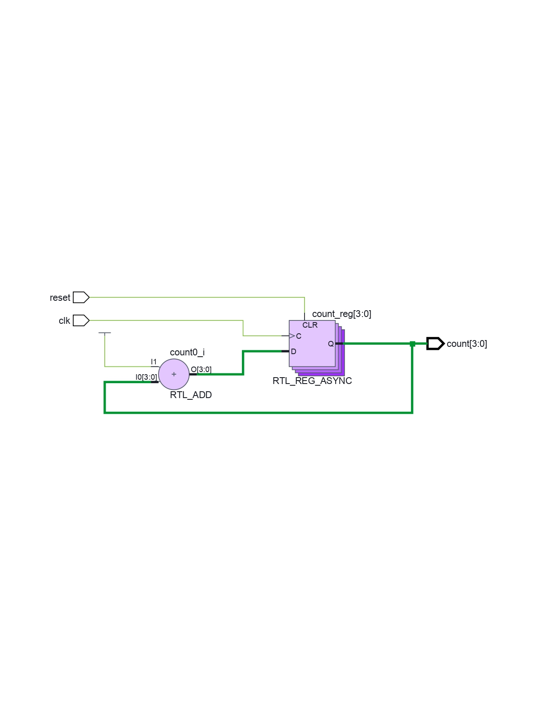
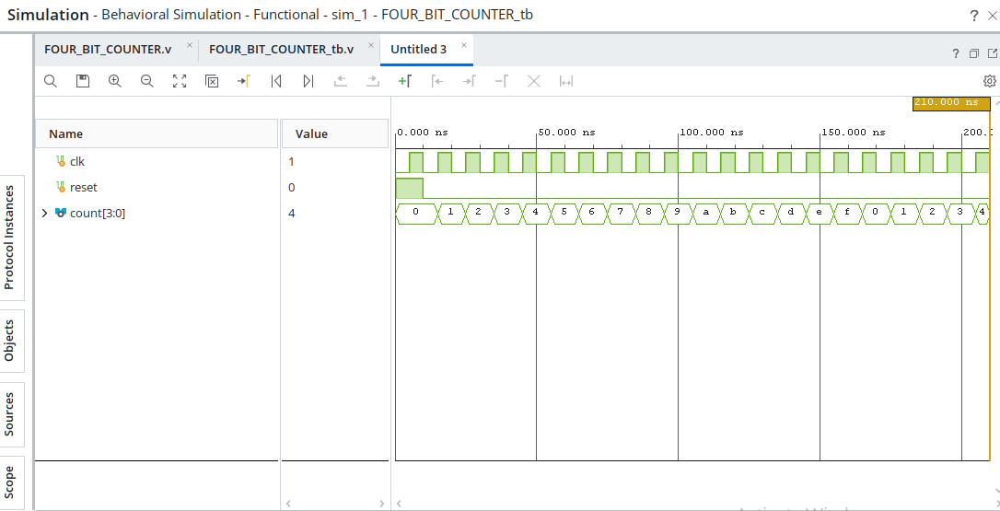

# 4-Bit Counter using Verilog HDL

## Overview

This project implements a **4-Bit Counter** using **Verilog HDL**. The counter increments its value on each active clock edge and generates a 4-bit binary count sequence. The design was developed and verified using **Xilinx Vivado 2026.1**.

---

## Features

* 4-bit binary counter
* Verilog HDL implementation
* Clock-driven operation
* Functional simulation using a Verilog testbench
* RTL schematic generation
* Simulation waveform verification
* Developed using Xilinx Vivado 2026.1

---

## Tools Used

* **Hardware Description Language:** Verilog HDL
* **EDA Tool:** Xilinx Vivado 2026.1
* **Simulator:** Vivado XSIM
* **Operating System:** Windows

---

## Project Structure

```text
.
├── MINOR_PROJECT.xpr
├── MINOR_PROJECT.srcs/
│   ├── sources_1/
│   │   └── FOUR_BIT_COUNTER.v
│   └── sim_1/
│       └── FOUR_BIT_COUNTER_tb.v
├── rtl_schematic.png
├── waveform_simulation.png
├── .gitignore
└── README.md
```

---

## Project Files

* **FOUR_BIT_COUNTER.v** – Main Verilog source code
* **FOUR_BIT_COUNTER_tb.v** – Testbench for functional verification
* **MINOR_PROJECT.xpr** – Vivado project file
* **rtl_schematic.png** – RTL schematic generated by Vivado
* **waveform_simulation.png** – Simulation waveform

---

## Working

1. The counter is initialized to zero.
2. On every active clock edge, the counter increments by one.
3. The output is a 4-bit binary value.
4. After reaching **1111 (15)**, the counter rolls over to **0000 (0)** and repeats the counting sequence.

---

## Expected Count Sequence

```text
0000
0001
0010
0011
0100
0101
0110
0111
1000
1001
1010
1011
1100
1101
1110
1111
0000
```

---

## How to Run

1. Open `MINOR_PROJECT.xpr` in Xilinx Vivado 2026.1.
2. Open the Verilog source and testbench files.
3. Run **Behavioral Simulation**.
4. Verify the simulation waveform.
5. Open **RTL Analysis** to view the RTL schematic.

---

## Results

### RTL Schematic



### Simulation Waveform



The simulation confirms that the counter increments correctly on each clock pulse and wraps back to zero after reaching the maximum count.

---

## Author

**Prasanna Lakshmi**

---

## License

This project is intended for educational and learning purposes.
